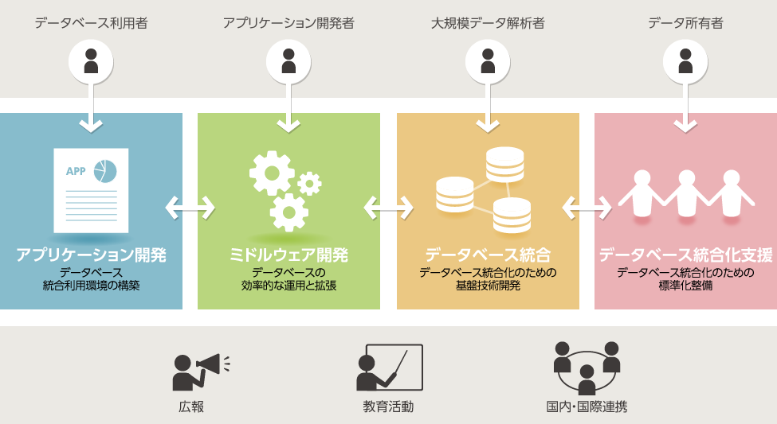
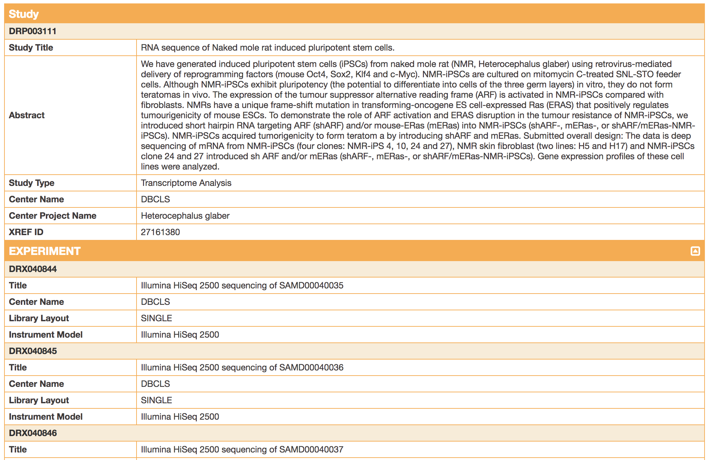
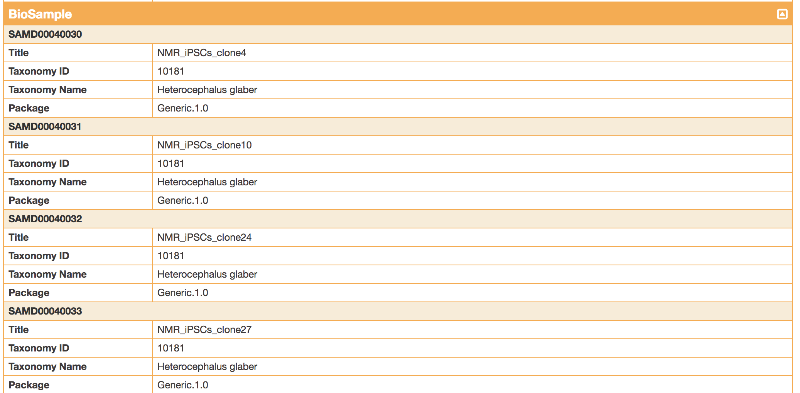
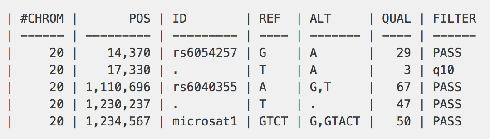

## PythonとJavaScriptによる生命科学データ解析における可視化サービスの構築

2018/06/04 at 東京

坊農秀雅 a.k.a. Dr.Bono

Note:
概論

---

## お前誰やねん

- [坊農秀雅](http://bonohu.jp/) / Hidemasa Bono, PhD. /  [@bonohu](https://twitter.com/bonohu)
- [温泉インフォマティクス研究会](https://twitter.com/kubor_/status/860448923441221632) 主催
- [Dr. Bonoの生命科学データ解析](http://bonohu.jp/blog/category/drbonobon.html) 上梓 (2017/9)


+++

### ライフサイエンス統合データベースセンター(DBCLS)所属

- 2007年4月設立の（国立）研究センター
  - 柏と三島の2拠点で活動
- ライフサイエンス分野DBとサービスの専門機関
- 利用者の利便性を高める情報技術の研究開発
  - DNA配列や発現DBを使いやすくする技術開発

https://dbcls.rois.ac.jp/

+++

### DBCLSでやっていること概要



---

## はなすこと
- 生命科学データ
- 生命科学における可視化手段
- その実例紹介（[大石さん](https://twitter.com/oec014)から）

---

## 生命科学データ

- 文字データ
  - 塩基(DNA)配列、アミノ酸配列
  - 研究やサンプルに関する記述（メタデータ）
  - 個体差（バリアント）
- 数値データ
  - 遺伝子の発現量
  - タンパク質立体構造の座標

**原則、無料。誰でも自由に使える！**

+++

### 塩基配列データ

```
>NM_007262.4 Homo sapiens Parkinsonism associated deglycase (PARK7), transcript variant 1, mRNA
TGAGTCTGCGCAGTGTGGGGCTGAGGGAGGCCGGACGGCGCGCGTGCGTGCTGGCGTGCGTTCATTTTCA
GCCTGGTGTGGGGTGAGTGGTACCCAACGGGCCGGGGCGCCGCGTCCGCAGGAAGAGGCGCGGGGTGCAG
GCTTGTAAACATATAACATAAAAATGGCTTCCAAAAGAGCTCTGGTCATCCTGGCTAAAGGAGCAGAGGA
AATGGAGACGGTCATCCCTGTAGATGTCATGAGGCGAGCTGGGATTAAGGTCACCGTTGCAGGCCTGGCT
GGAAAAGACCCAGTACAGTGTAGCCGTGATGTGGTCATTTGTCCTGATGCCAGCCTTGAAGATGCAAAAA
AAGAGGGACCATATGATGTGGTGGTTCTACCAGGAGGTAATCTGGGCGCACAGAATTTATCTGAGTCTGC
TGCTGTGAAGGAGATACTGAAGGAGCAGGAAAACCGGAAGGGCCTGATAGCCGCCATCTGTGCAGGTCCT
ACTGCTCTGTTGGCTCATGAAATAGGTTTTGGAAGTAAAGTTACAACACACCCTCTTGCTAAAGACAAAA
TGATGAATGGAGGTCATTACACCTACTCTGAGAATCGTGTGGAAAAAGACGGCCTGATTCTTACAAGCCG
GGGGCCTGGGACCAGCTTCGAGTTTGCGCTTGCAATTGTTGAAGCCCTGAATGGCAAGGAGGTGGCGGCT
CAAGTGAAGGCTCCACTTGTTCTTAAAGACTAGAGCAGCGAACTGCGACGATCACTTAGAGAAACAGGCC
GTTAGGAATCCATTCTCACTGTGTTCGCTCTAAACAAAACAGTGGTAGGTTAATGTGTTCAGAAGTCGCT
GTCCTTACTACTTTTGCGGAAGTATGGAAGTCACAACTACACAGAGATTTCTCAGCCTACAAATTGTGTC
TATACATTTCTAAGCCTTGTTTGCAGAATAAACAGGGCATTTAGCAAACTAAAAAAAAAAAAAAAAAAA
```

+++
### メタデータ（研究）



+++
### メタデータ（サンプル）



+++
### 個体差

- ヒト30億塩基対に1000塩基に1つ
  - 一塩基多型が多い
- それを記述する形式:
  - VCF(Variant Call Format)



`csvlook`による可視化(?)

+++
### 遺伝子発現量

- 例: [ヒトの10組織（RNA-seqによる）](https://doi.org/10.6084/m9.figshare.4028661)

+++
### タンパク質立体構造

- 例: [PDBj(HIF1A)](https://pdbj.org/mine/summary/1h2k)

---

## ヒトデータの可視化手段

例：配列の場合、典型的には

1. Reference(参照)ゲノム配列にマッピング
2. ゲノムブラウザで可視化

数値データの場合は、多次元のデータが多いので、主成分分析して第1,2主成分で散布図なんてこともしばしば

+++

### Reference ゲノム配列

- 2003年に完全解読したヒトゲノム、その更新版
- そのありか
  - [Ensembl](http://asia.ensembl.org/info/data/ftp/index.html)
  - [UCSC](http://hgdownload.soe.ucsc.edu/downloads.html)

**これらも、無料で誰でも無制限に使える！**

+++

### ゲノムマッピング

- 入力: 100-150塩基 x 約1億
- 検索対象: ヒトゲノム配列(30億塩基)
  - Burrows Wheeler Transform
    - 検索対象文字列の出現位置を高速に検索できるように
  - その実装
    - [Bowtie](http://bowtie-bio.sourceforge.net/)
    - [BWA](http://bio-bwa.sourceforge.net/)

**すべてフリーウェア**

---

## ゲノムブラウザ

http://genome-asia.ucsc.edu

[詳しくは統合TVにて動画で使い方を紹介](http://doi.org/10.7875/togotv.2017.105)

---
